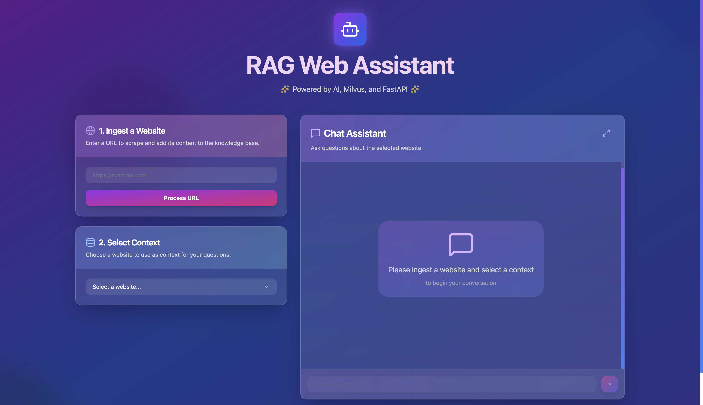
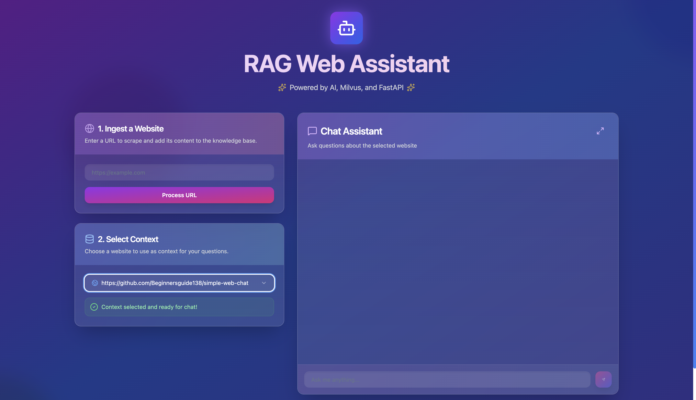
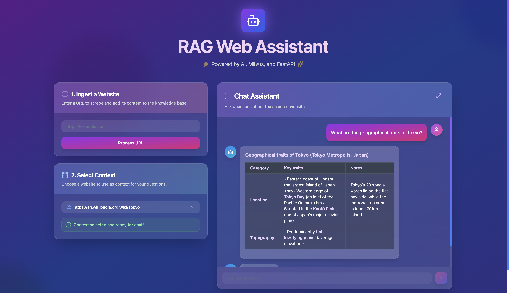
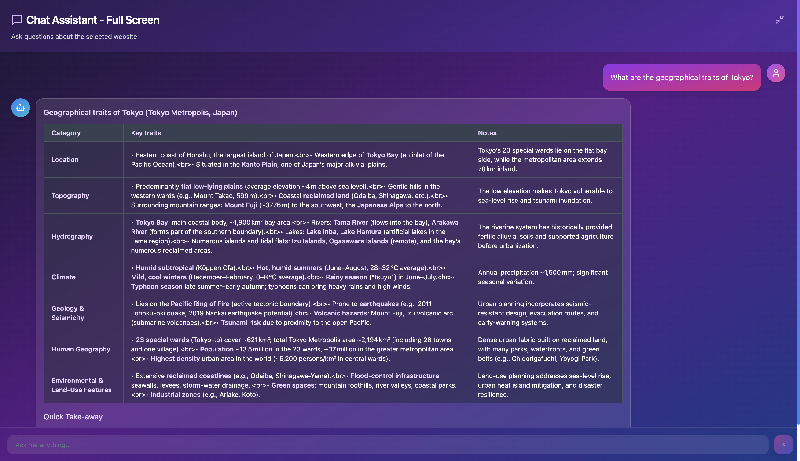

# RAGベースWebコンテンツチャットアプリケーション

> 🌍 **言語**: [English](README_EN.md) | [中文](README_ZH.md) | **日本語**

このプロジェクトは、複数のWebサイトのコンテンツを取り込み、ベクトルデータベースに保存し、特定のサイトのコンテンツとRAG（Retrieval-Augmented Generation）技術を使ってチャットできるフルスタックWebアプリケーションです。

モダンな技術スタックを使用し、コンテナ化されたシンプルで使いやすいユーザーインターフェースを提供します。

## 📚 初心者向けガイド

このリポジトリを使って技術スタックを学びたい初心者の方は：
👉 **[初心者向け詳細ガイド](BEGINNER_GUIDE.md)** をご覧ください

## ✨ 主な機能

- **Webスクレイピング**: 任意の数のURLからコンテンツを取得
- **マルチコンテキストチャット**: 取得したURLごとに独立したコンテキストを作成し、特定のWebサイトのコンテンツとチャット
- **ベクトル埋め込み**: Ollamaの`mxbai-embed-large`モデルを使用してWebコンテンツの埋め込みを生成
- **パーティション分割されたベクトル格納**: 各URLのコンテンツを独立したパーティションに保存するMilvusベクトルデータベース
- **RAGチャット**: Ollamaの生成モデルを使用して保存されたコンテンツに基づいて質問に回答
- **モダンなWebUI**: Webサイトの取り込みとチャットのためのReactフロントエンド

## 🛠️ 技術スタック

- **バックエンド**: FastAPI (Python)
- **フロントエンド**: React (TypeScript) + Vite + `shadcn/ui`
- **ベクトルデータベース**: Milvus (v2.3.10)
- **LLM サービング**: Ollama（ホストマシンで実行）
  - **埋め込みモデル**: `mxbai-embed-large`
  - **生成モデル**: 設定可能
    - `gpt-oss:20b` - フルモデル（13GB以上のメモリが必要）
    - `tinyllama` - 軽量モデル（638MB）
- **コンテナ化**: Docker および Docker Compose

## ⚠️ 重要なアーキテクチャ説明

### なぜホストマシンでOllamaを実行するのか？

このプロジェクトは**ホストマシンでOllamaを実行**し、Dockerコンテナからアクセスするアーキテクチャを採用しています。これは以下の理由によります：

1. **GPU加速の利用**: ホストマシンのGPU（Metal Performance Shadersなど）を直接活用
2. **メモリ効率**: Dockerのメモリ制限を回避し、システムメモリを効率的に利用
3. **パフォーマンス**: ネイティブ実行による高速な推論

💡 **つまり、Docker Desktopのメモリ設定は変更不要です**

## 📋 前提条件

### 必須要件

1. **[Docker Desktop](https://www.docker.com/get-started/)** がインストールされ、実行されていること
2. **[Ollama](https://ollama.ai/)** がホストマシンにインストールされ、実行されていること

### メモリ要件（ホストマシン）

- **gpt-oss:20bモデル使用時**: 最低16GB RAM推奨（モデルサイズ：約13GB）
- **tinyllamaモデル使用時**: 4GB RAM（軽量版、638MB）

## 🚀 クイックスタート

### 1. リポジトリのクローン

```bash
git clone <repository-url>
cd <repository-directory>
```

### 2. Ollamaのセットアップ（重要！）

#### Ollamaのインストール
```bash
# macOS
curl -fsSL https://ollama.ai/install.sh | sh

# または Homebrew
brew install ollama
```

#### Ollamaの起動
```bash
# バックグラウンドで起動
ollama serve
```

#### 必要なモデルのダウンロード
```bash
# 埋め込みモデル（必須）
ollama pull mxbai-embed-large

# 生成モデル（どちらか一つを選択）
ollama pull gpt-oss:20b      # 高品質モデル（16GB+ RAMが必要）
# または
ollama pull tinyllama        # 軽量モデル（4GB RAMで動作）
```

### 3. モデル設定（オプション）

`.env`ファイルを編集してモデルを選択：

```bash
# 高品質モデル（16GB+ RAM必要）
GENERATION_MODEL=gpt-oss:20b

# 軽量モデル（4GB RAMで動作、デフォルト）
GENERATION_MODEL=tinyllama
```

### 4. アプリケーションの起動

```bash
docker-compose up --build
```

### 5. アクセス

Webブラウザで以下にアクセス：
**http://localhost:5173**

## 📖 使い方



### 1. Webサイトの取り込み

- 「1. Ingest a Website」セクションで、処理したいWebサイトのURLを入力
- 例: `https://ja.wikipedia.org/wiki/人工知能`
- 「Process URL」ボタンをクリック
- 複数のURLを処理可能


### 2. コンテキストの選択

- Webサイトを取り込むと「Select a context to chat with」ドロップダウンが表示
- チャットしたいWebサイトを選択



### 3. チャット

- 「2. Chat」セクションで選択したWebサイトのコンテンツについて質問
- 質問を入力してEnterキーまたは送信ボタンをクリック
- 選択されたWebサイトの情報のみから回答を生成





## 🔧 トラブルシューティング

### Ollamaへの接続エラー

**症状**: "Could not connect to Ollama" エラー

**解決方法**:
```bash
# Ollamaが起動しているか確認
ollama serve

# または別ターミナルで
ollama list
```

### メモリ不足エラー

**症状**: "out of memory" エラー

**解決方法**:
1. **軽量モデルに変更**:
   ```bash
   # .envファイルを編集
   GENERATION_MODEL=tinyllama
   ```

2. **アプリケーションを再起動**:
   ```bash
   docker-compose down
   docker-compose up --build
   ```

### モデルの性能比較

| モデル | メモリ使用量 | 品質 | 用途 |
|--------|-------------|------|------|
| gpt-oss:20b | ~13GB | 高品質 | 本格運用・高品質な回答が必要 |
| tinyllama | 638MB | 基本品質 | テスト・学習・制限環境 |

## 🐳 Docker サービス構成

`docker-compose.yml`で定義されているサービス：

- **etcd**, **minio**, **milvus**: Milvusベクトルデータベースと依存関係
- **backend**: メインAPIを提供するFastAPIアプリケーション
- **frontend**: ReactフロントエンドのVite開発サーバー

注意: **ollama**サービスはコメントアウトされており、ホストマシンのOllama（`host.docker.internal:11434`）を使用

## 🔧 環境変数

`.env`ファイルでサポートされている環境変数：

- `GENERATION_MODEL`: テキスト生成用LLMモデル（デフォルト: `gpt-oss:20b`）
- `EMBEDDING_MODEL`: 埋め込み生成用モデル（デフォルト: `mxbai-embed-large`）

## 📄 ライセンス

[MIT License](LICENSE)

---

## 🤖 生成AIによる作成
このプロジェクトのコード、ドキュメント、構成の大部分は、生成AIの支援を受けて作成されました。

---

### 🆘 サポートが必要ですか？

- 初心者の方: [初心者向け詳細ガイド](BEGINNER_GUIDE.md)
- 技術的な問題: Issuesタブでお気軽にご質問ください
- 他言語での説明: [English](README_EN.md) | [中文](README_ZH.md)
